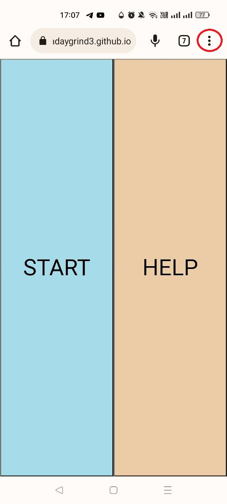
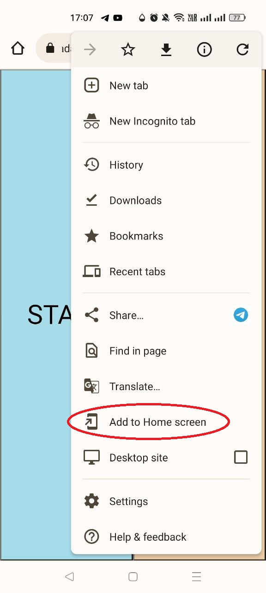
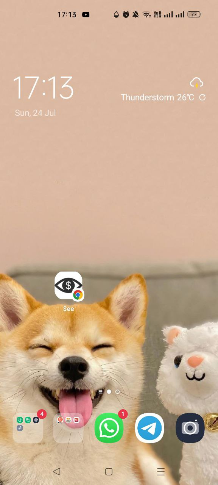

# curren$ee
curren$ee is an application that helps you to identify your currency.
 
 
:exclamation: This app can be viewed on your mobile app browser, desktop web browser or even as a PWA! 

> We have also made it a PWA! Here's how you can do it!
> 1. (This is a demonstration on Google Chrome) Click on the 3 dots on the top right hand corner, circled in red.
>  
> 2. You will see this drop-down menu. Click on the "Add to Home Screen" button.
>  
> 3. Voila! 
>  

## How to use this app? 
1. On the landing page, there are two buttons. 
    - Left: "Start" button
    - Right: "Help" button
2. Click on the "Start" button once to initialise the camera.
3. Click on the "Help" button to get instructions on how to use this site!

# References/ Tutorials
- [Javascript Text-to-Speech](https://codersblock.com/blog/javascript-text-to-speech-and-its-many-quirks/)
- [Javascript setInterval](https://www.w3schools.com/jsref/met_win_setinterval.asp)
